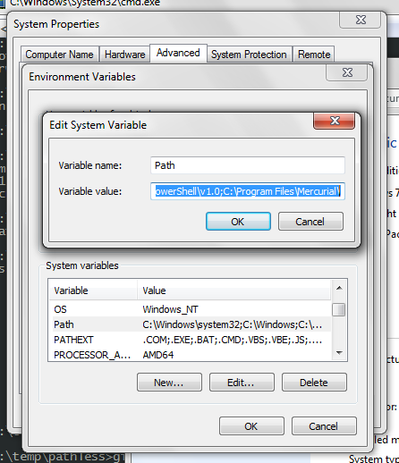
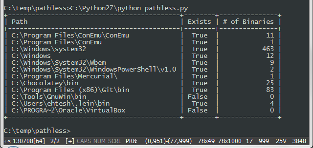

I'm writing an editor for the PATH, called `pathless`. 

I was kind of fed up with editing the path like this:

I wanted a more convenient way to look at the path. Something like:

Well, I found out that other tools like mine exist, though. There's a list of some of them at http://superuser.com/questions/297947

It's still useful for me to program this to become more familiar with the way Windows works. In the end, I'm trying to improve the quality of tools that allows people like me to easily configure Windows. There are a lot of tools out there, but some of them are buggy and closed source or paid, and I think I can do better than that.
